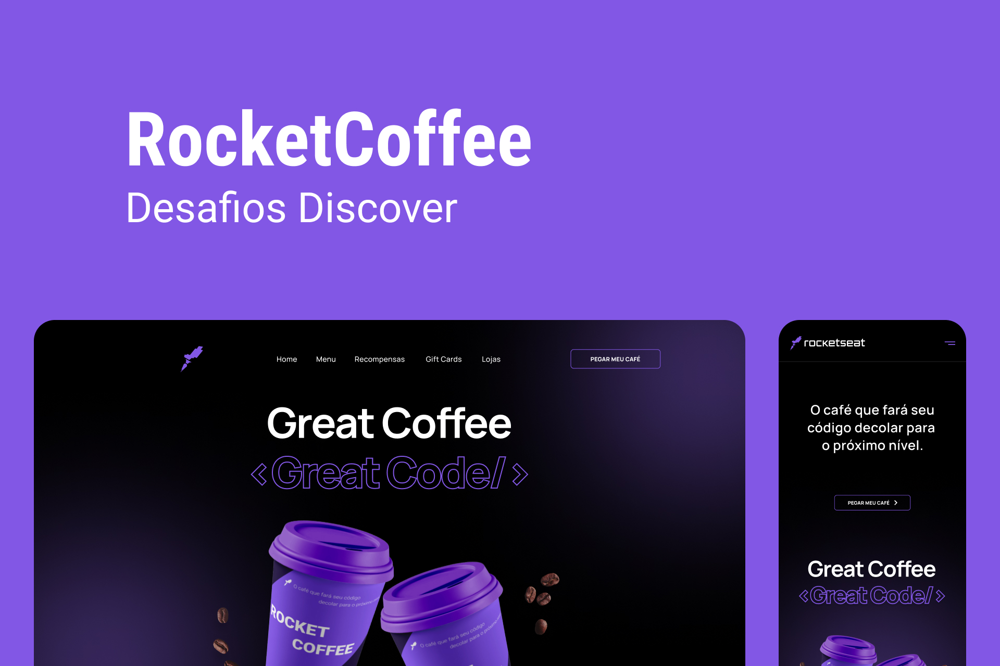

<h1 align="center"> Desafio RocketCoffee :coffee: </h1>

Desafio proposto pelo site da Rocketseat pra desenvolver uma homepage para uma marca de café.

 

  

## 🚀 Tecnologias

Esse projeto foi desenvolvido com as seguintes tecnologias:

- HTML, CSS & JavaScript
- Git e Github

---

Feito com ♥ by Yasmin
